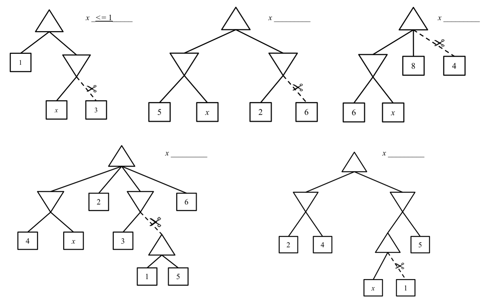

## Podando árboles

En las siguientes imágenes se busca poder realizar la poda $\alpha$--$\beta$ en donde se marca en cada imagen. Las jugadas están ordenadas de izquierda a derecha como es usual. Para esto es necesario dar un valor a la variable $x$ de cada figura, tal como se muestra de ejemplo en el primer problema. En caso de no poder asignar un valor donde la poda se efectúe, favor de explicitarlo claramente.

## Te para tres

Supongamos que tenemos un juego suma cero, pero con tres jugadores (jugadores A, B, C), los cuales solamente pueden realizar dos acciones (izquierda y derecha). Si simulamos una ronda de todos los jugadores, y los valores finales, los cuales están ordenados para el jugador A, B y C respectivamente, tenemos el árbol de juego siguiente:

1. ¿Cual es la utilidad para cada acción que pueda realizar el jugador A, si la propagamos con *minimax*? Escribe los valores de utilidad para cada jugada en el árbol de juego.

2. ¿Es posible hacer una poda similar a la $\alpha$--$\beta$ de éste árbol de juego? De ser así explica la manera y marca las ramas podadas en una poda óptima. Se no ser posible, justifica tu respuesta.

## Un lindo gatito

Vamos a realizar un super excitante juego llamado el Gato de 2 × 2. Este juego es como el juego del gato, pero con solamente 4 casillas. Como cosa adicional, a los jugadores se les permite pasar. Las X siempre empiezan.

1. Dibuja el árbol de juego hasta una profundidad de 2. No agregues posiciones que sean rotaciones o reflexiones de la misma jugada. El árbol deberá tener al final 5 nodos hoja.

2. Si la función de utilidad es el número de X menos el número de O en el tablero, marca los valores de cada nodo, e indica cuales ramas serían podadas si utilizamos un algoritmo de poda $\alpha$--$\beta$, y un ordenamiento de izquierda a derecha, de acuerdo a tu propio árbol que dibujaste.

3. Si quisiéramos resolver completamente el juego, explica porque en este caso la poda $\alpha$--$\beta$ con un ordenamiento de jugadas apropiado sería mucho mejor que el algoritmo básico de *minimax*.

## Dios mueve al jugador, y éste, la pieza

Ahora, realiza un reporte donde expliques de forma concisa, la manera en que se evalúan los estados en una máquina de inferencia de ajedrez. Puedes consultar entre otras cosas:

1. [Tutorial de en Youtube para programar tu propio ajedrez por Eddie Sharick](https://www.youtube.com/channel/UCaEohRz5bPHywGBwmR18Qww), y la [implementación hecha por Mikołaj Skrzypczak](https://github.com/mikolaj-skrzypczak/chess-engine)

2. El proyecto de github de [*Minimal Chess Engine*](https://github.com/lithander/MinimalChessEngine) (un motor de ajedrez mínimo programado en C#), que viene con documentación y con 3 video-tutoriales.

3. [Una entrada de blog de *chessify.me](https://chessify.me/blog/chess-engine-evaluation) donde trata de explicar, aunque a muy alto nivel como evalúan algunas de las máquinas de inferencia libres más famosas.

4. La Wiki de [chessprogramming.org](https://www.chessprogramming.org/Main_Page). Ahi viene evaluación que te lleva a diferentes documentos.

